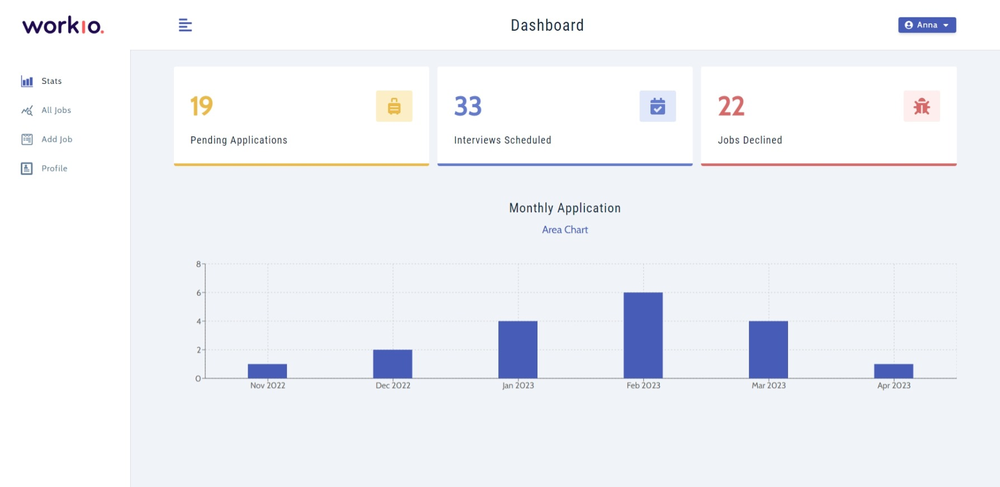
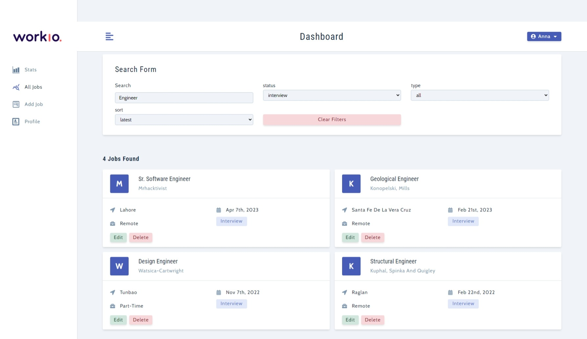
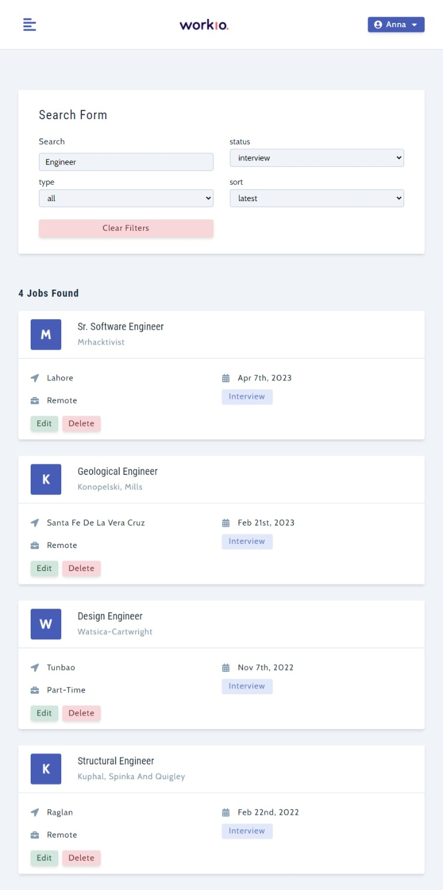
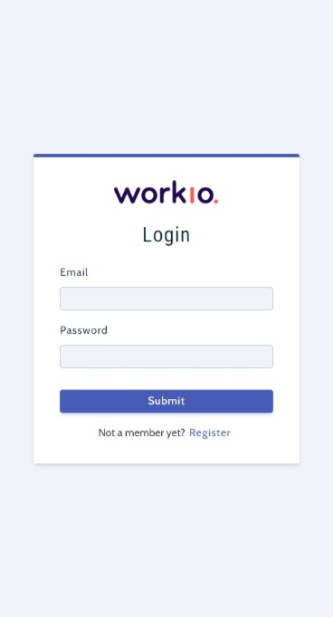

# WorkIo: Job Searching Web App

This is a web application designed to simplify the job search process for job seekers by providing them with an efficient platform to find and apply for job listings. Users can create profiles, upload their resumes, and search for job listings based on different criteria such as location, industry, and job title. The job listings will contain comprehensive information about the job role, the company, and the requirements for the job.

The app is built using the MERN stack, which includes MongoDB, ExpressJS, ReactJS, and NodeJS. The project follows the MVC (Model-View-Controller) architecture to ensure a clear separation of concerns between the various components of the application.

## Technologies Used

* MongoDB
* ExpressJS
* ReactJS
* NodeJS

## Features

* User authentication via backend (NodeJS)
* React Routers for navigation
* Custom error middleware
* Followed the MVC structure

## Screenshots

|  |  |
| :---:   | :---: |
|  |  |

## Live Demo

The live version of the application can be accessed at https://workio.onrender.com/

## Installation and Usage

1. Clone the repository `git clone https://github.com/saimhafeez/mrh-workio`
2. Change to the project directory `cd mrh-workio`
3. Navigate to client Folder `cd client`
4. Install the required dependencies `npm install`
5. Navigate to server Folder `cd server`
6. Install the required dependencies `npm install`
7. Run the server `npm run server`
8. No need to run client in a seperate terminal (because client folder is used as public)
9. Open the browser and navigate to http://localhost:5000

## Contributions

Contributions are welcome. If you would like to contribute to this project, please fork the repository and submit a pull request.

## License

This project is licensed under the [MIT License](https://opensource.org/licenses/MIT).
